# Reid Shop Project 
*Online fashion store project. The idea behind the project was to form a complete management program for the online store from sales to product, order and customer management. From there, the store owner will clearly grasp the information, shorten the sales cycle, and manage the store in the traditional way.* 
## Technology

#### Front-End
- HTML5
- CSS
- Bootstrap 4
- JavaScript
- JQuery

#### Back-End
- Java

#### Database management system
- SQL Server

## Main feature
- Log in / sign up
- Delegation of rights
- Manage orders / Customers / Orders
- Payment: COD, MOMO (QRCODE), VNPay
- Cart
- Purchase
- Account Management
- Contact Info
- There are many other features...

## Preview
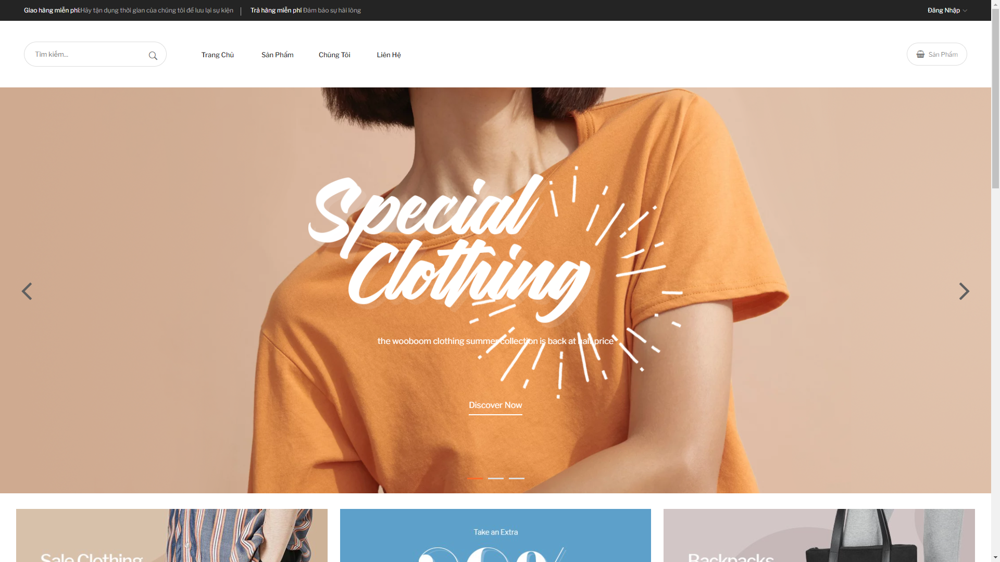&nbsp;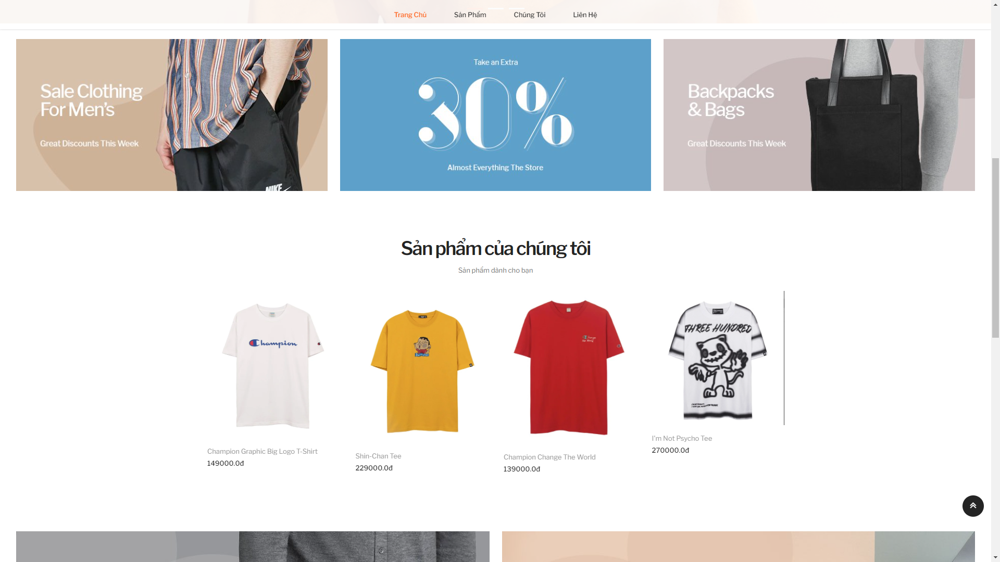&nbsp;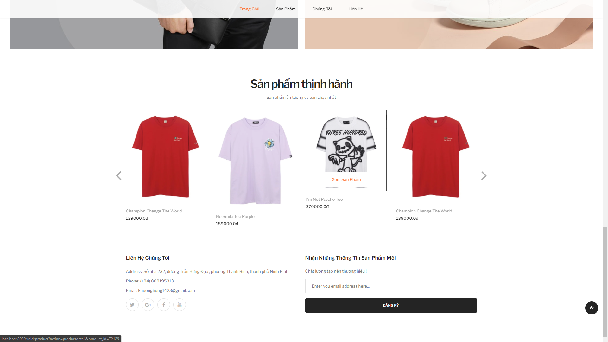
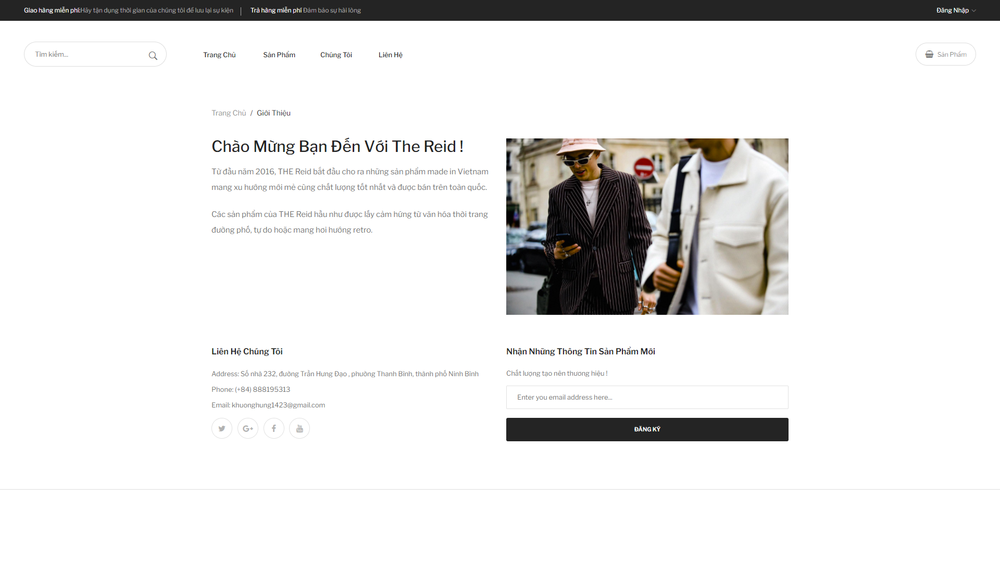&nbsp;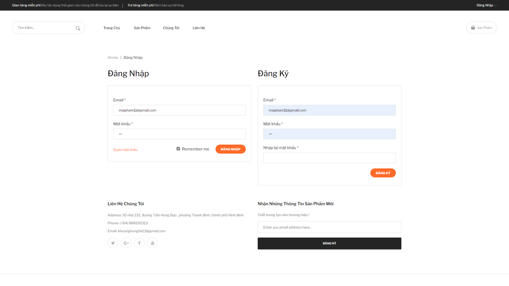&nbsp;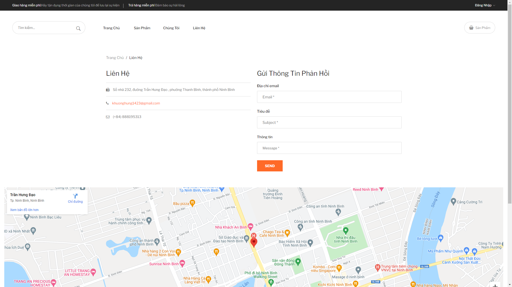
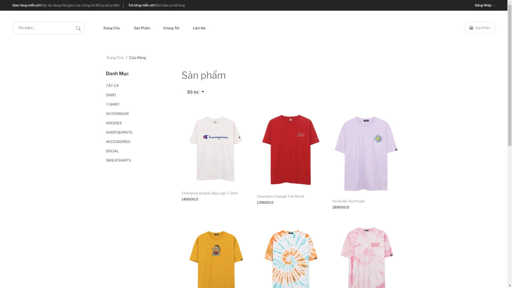&nbsp;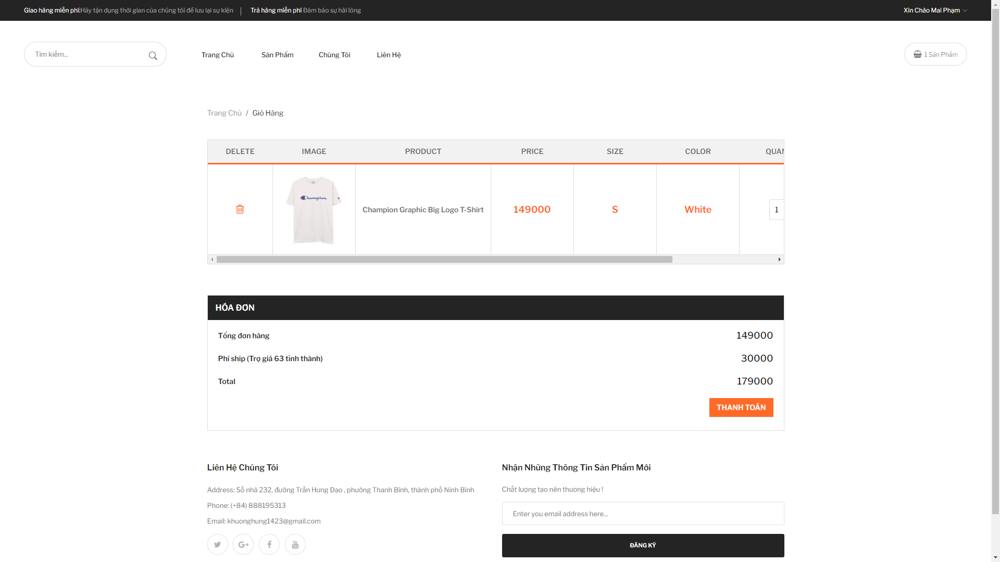&nbsp;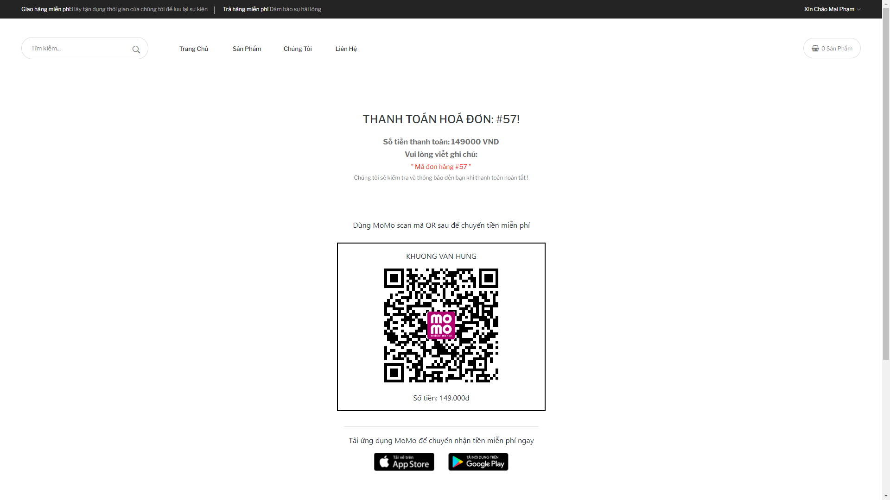
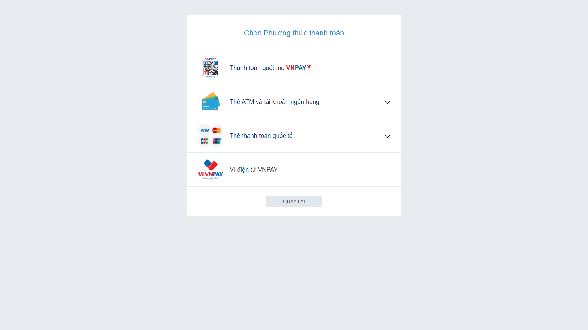&nbsp;&nbsp;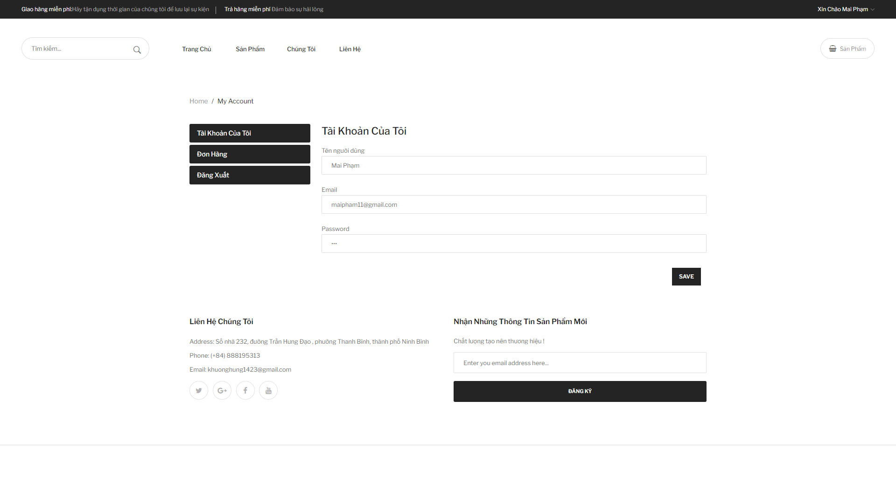
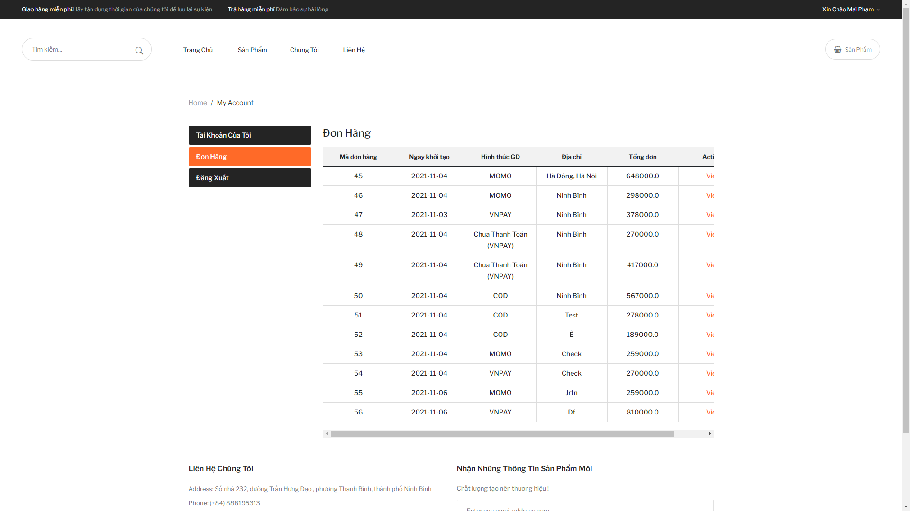&nbsp;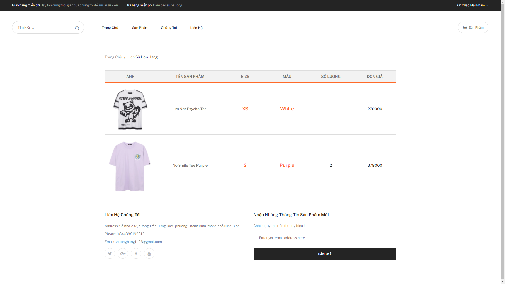&nbsp;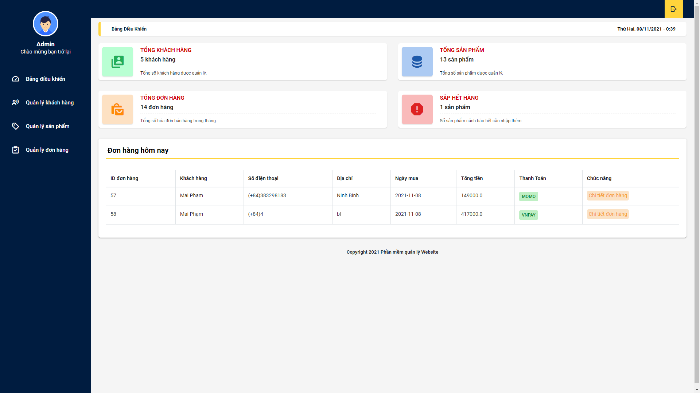
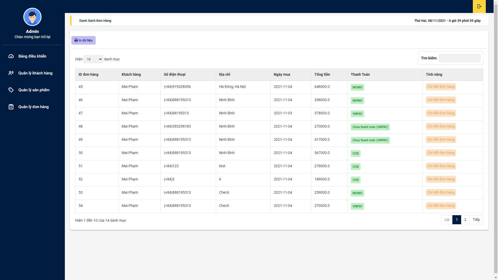&nbsp;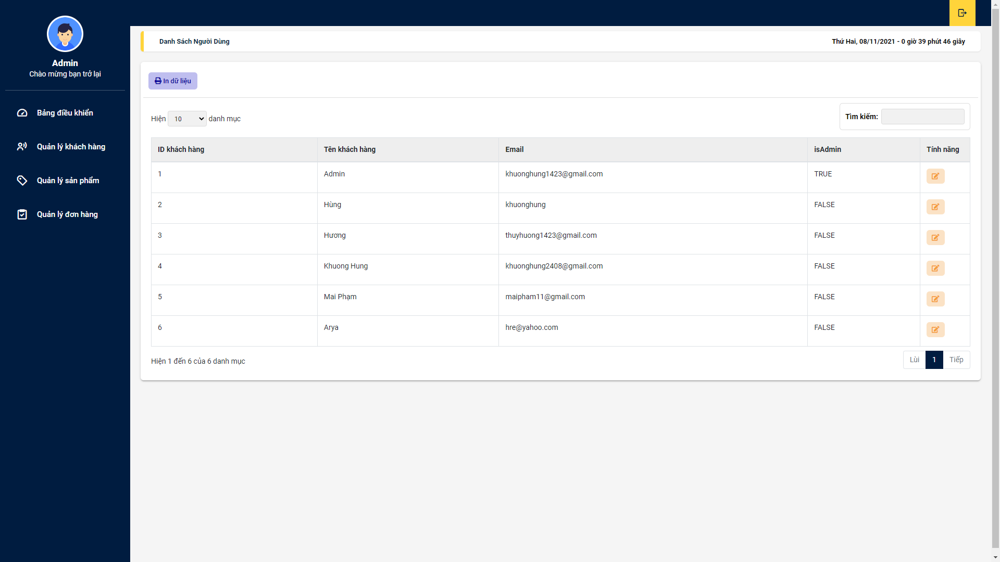&nbsp;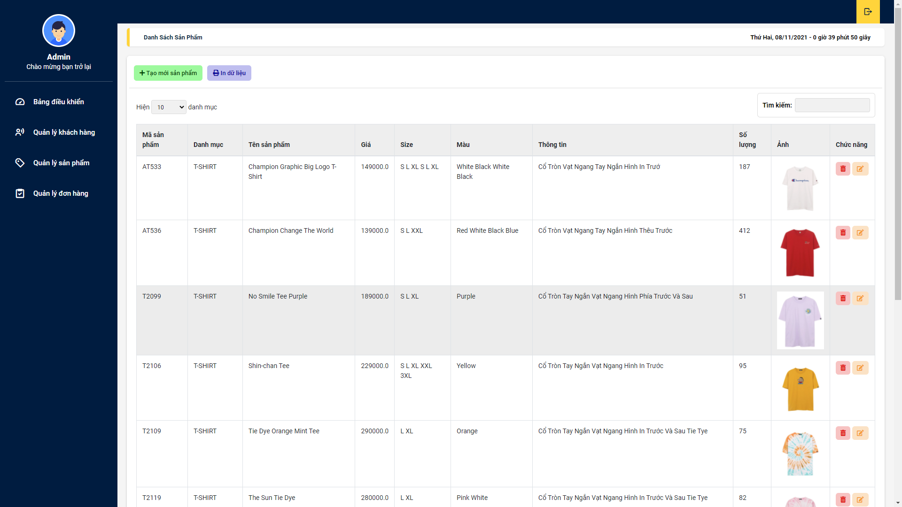
 
ETC...

## Contribute
- Thank Vo Truong for sharing the CRUD theme

Copyright (c) 2021, Khuong Hung